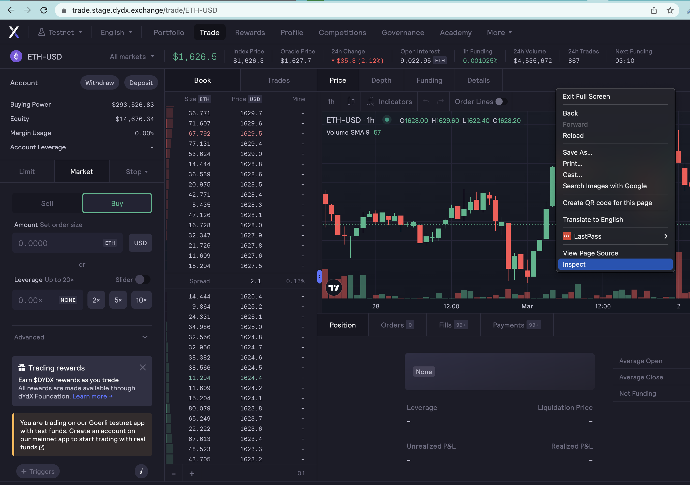
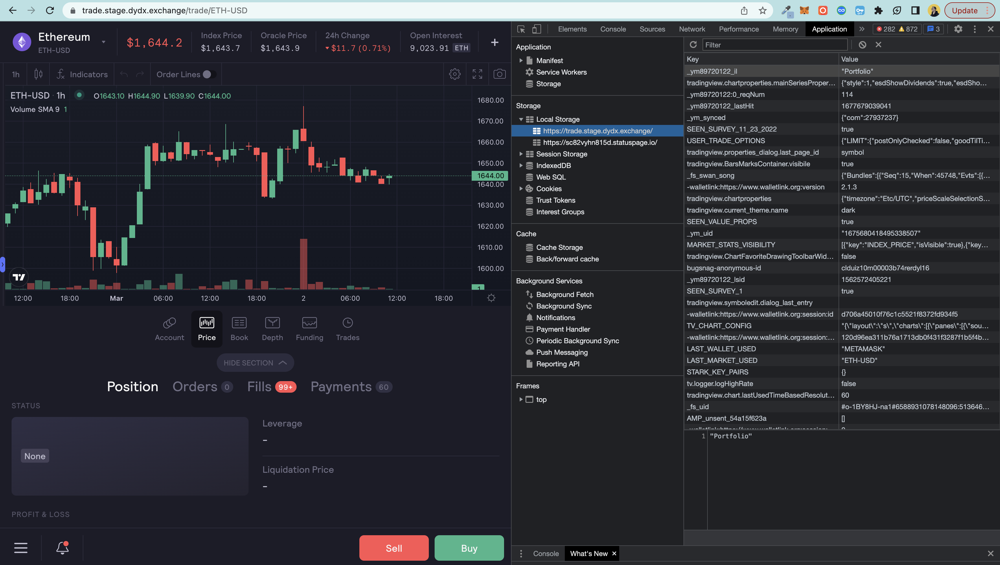

---
jupytext:
  formats: md:myst
  text_representation:
    extension: .md
    format_name: myst
kernelspec:
  display_name: Python 3
  language: python
  name: python3
---
(chapter1_part1)=

# 1.1. Creating account & generating keys
To interact with the dydx protocol, you need to create an account on dydx platform. There are two types of dydx platforms to consider: one on mainnet (https://trade.dydx.exchange) and one on testnet (https://trade.stage.dydx.exchange). In this guide we use the latter platform, as it is identical to the mainnet and allows you to use virtual money to explore the platform without the risk of investing real money. Once you feel confident, the mainnet is the place where you can invest real money for real profits.

## 1.1.1. Account Creation

To create an account:

1. Go to the [dydx platform](https://trade.stage.dydx.exchange/) and click **Connect Wallet** on the top right corner.
2. Choose wallet you would like to connect. In this guide we use [Metamask](https://metamask.io/).
3. On Link Wallet window, mark Remember Me flag and sign two requests in Metamask wallet.


## 1.1.2. Keys Extraction

Extract API_KEY_PAIRS and STARK_KEY_PAIRS from dydx.

1. Go to the developer settings on your browser (with Chrome: right-click -> inspect page)



2. Open **Application**
3. In **Storage** -> **Local Storage**, open https://trade.stage.dydx.exchange/ and find API_KEY_PAIRS and STARK_KEY_PAIRS.
    - API_KEY_PAIRS is a Metamask key.
    - STARK_KEY_PAIRS is a Dydx key.

  
4. Save these keys as dictionaries in Python. We will need them later. 


```{code-cell} ipython3
# dict with Metamask account creds

API_KEY_PAIRS = {
  "walletAddress": "0x02WQnO69112bdEB7V6339671e4c36f5F7de82b57",
  "secret": "r3UI_OiC0pmt3ShNz0oiEoHpIXACWwkUC2q1WWHD",
  "key": "5xx0dc83-a4cf-6e29-6afa-f21b3i74f347",
  "passphrase": "cV2KiULwiw6RwMgMd35d",
  "legacySigning": False,
  "walletType": "METAMASK"
}
```

```{code-cell} ipython3
# dict with dydx account creds

STARK_KEY_PAIRS = {
  "walletAddress": "0x02WQnO69112bdEB7V6339671e4c36f5F7de82b57",
  "publicKey": "012ecde10e6ddb43b961673d45rtab8c2e93604f34f419b24eef1e80af8347ee",
  "publicKeyYCoordinate": "04bb0cc4efe5eba08f5d35d7310d520093e22804fa562d820e8df0176c0fa371",
  "privateKey": "045683f987043e98536470976dbb145d44c1100drd237740d4096e5a21d1e79c",
  "legacySigning": False,
  "walletType": "METAMASK"
}
```

From these dicts you can later easily extract Metamask secret key or Dydx secret key:

```{code-cell} ipython3
print(f"Metamask secret key: {API_KEY_PAIRS['secret']}")
print(f"Dydx secret key: {STARK_KEY_PAIRS['privateKey']}")
```